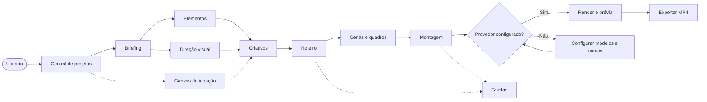

# TG Criativo — mapa 80/20 por rota

## Princípio

O produto tem dois níveis: o **fluxo comercial principal**, que entrega criativos para TikTok e Instagram, e rotas técnicas que dão profundidade ao estúdio. A análise 80/20 começa pelo primeiro; sem briefing, criativo, roteiro e montagem, o restante não gera valor de negócio.

## Rotas da experiência TG

| Rota | Nome TG | O que é | Valor estratégico |
| --- | --- | --- | --- |
| `/criativo/` | Central de projetos | Entrada, projetos e criação de campanha | Prioridade máxima |
| `/criativo/projects/:id/ingest` | Briefing | Objetivo, público, oferta, referências e materiais | Define a campanha |
| `/criativo/projects/:id/characters` | Elementos | Pessoas, identidades, ambientes, objetos e vozes | Mantém consistência |
| `/criativo/projects/:id/episodes` | Criativos | Lista e seleção das variações comerciais | Permite testar ângulos |
| `/criativo/projects/:id/episodes/:ep/script` | Roteiro | Texto-base, roteiro e planejamento de elementos | Converte estratégia em execução |
| `/criativo/projects/:id/episodes/:ep/beats` | Cenas | Organização de cenas e quadros | Transforma roteiro em visual |
| `/criativo/projects/:id/episodes/:ep/compose` | Montagem | Combina mídia, áudio e legendas | Produz o vídeo |
| `/criativo/projects/:id/episodes/:ep/video` | Vídeo | Prévia, render e exportação | Saída para publicação |
| `/criativo/projects/:id/styles` | Direção visual | Estilo, proporção, referência e linguagem visual | Padroniza a marca |
| `/criativo/projects/:id/freezone` | Canvas | Ideação visual livre, nós e referências | Laboratório criativo |

## Rotas de apoio

| Rota | Função |
| --- | --- |
| `/criativo/projects/:id/episodes/:ep/overview` | Resumo do criativo |
| `/criativo/projects/:id/episodes/:ep/sketches` | Estudos/rascunhos visuais |
| `/criativo/projects/:id/episodes/:ep/audio` | Narração e áudio |
| `/criativo/projects/:id/assistant` | Assistente do projeto |
| `/criativo/projects/:id/tasks` | Acompanhamento de tarefas |
| `/criativo/credits` | Créditos e consumo |
| `/criativo/watch/:work` | Visualização de trabalho/exportação |
| `/criativo/download` | Download de aplicativo/artefatos |
| `/criativo/login` | Autenticação técnica; não é uma etapa comercial |

## Fluxo 80/20

1. Criar campanha na Central.
2. Preencher Briefing e inserir referências.
3. Definir Elementos e Direção visual.
4. Criar 3–5 variações em Criativos.
5. Refinar Roteiro e Cenas.
6. Montar, validar e exportar o Vídeo.

Canvas é uma rota paralela: entra antes para explorar uma ideia ou durante a produção para destravar uma cena. Tarefas e Créditos são observabilidade, não etapas de criação.

## Mermaid — fluxo de interação

## Estado atual verificado

O percurso até roteiro está funcional para dados manuais: briefing, elementos, Canvas e cinco criativos persistem. A passagem de roteiro para mídia real está bloqueada por credenciais externas ausentes. Isso não é um erro de interface, mas impede homologar renderização e MP4.
